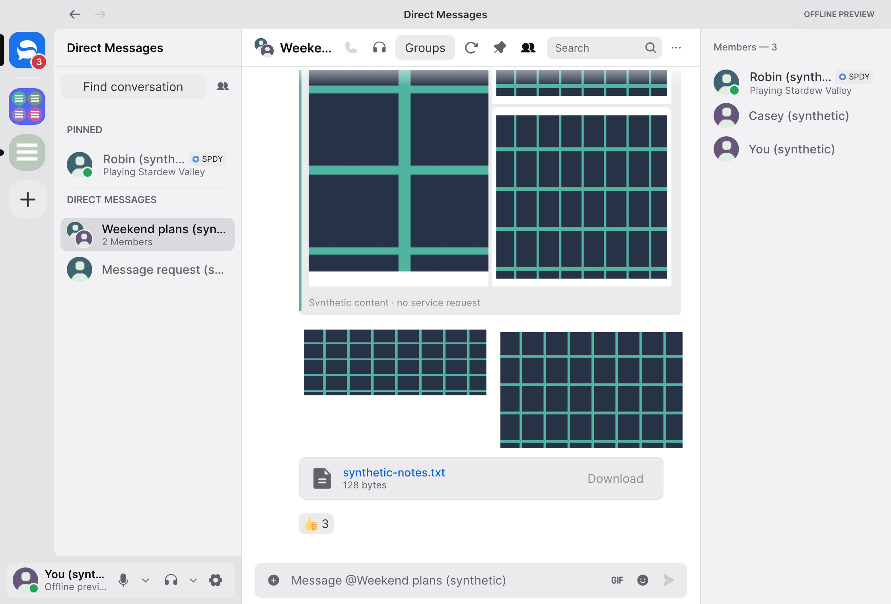
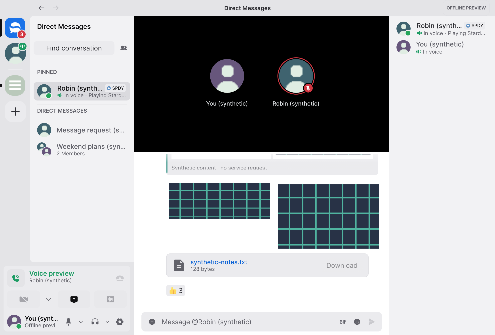

<div align="center">

# Discut

**Your Discord. A smaller footprint.**

A native Rust client for conversations, groups and calls.

[Get started](#get-started) · [Features](#your-conversations-on-your-desktop) · [Performance](#less-overhead-measured) · [Roadmap](ROADMAP.md) · [Contribute](CONTRIBUTING.md)

</div>

Discut connects to your existing Discord account and is built around the things you
open Discord for: servers, direct messages, group chats and calls. It uses a native
Rust interface, with message history loaded as you need it.

No shop, Quests, embedded Activities or game overlays. No Electron runtime.

> **Early preview:** the Mac app builds locally. Live sign-in, conversation completeness
> and two-way calls still need recorded acceptance testing. Windows and Linux are source
> targets awaiting native validation. There is no supported binary release yet.



*Current image: an offline fixture, not a live Discord account. [Screenshot details](docs/screenshots/README.md).*

## Your conversations, on your desktop

| Feature | What Discut is built to do |
| --- | --- |
| Your existing account | Sign in through the app and load the servers, DMs and groups supplied by Discord. No separate Discut account or manual chat migration. |
| Everyday messaging | Read and send messages, reply, react, share attachments and keep drafts. Load older history as you scroll. |
| Groups | Create group conversations and manage members, alongside server channels and direct messages. |
| Calls | Native voice, camera and screen-sharing implementation, with live interoperability still under verification. |
| Your workspace | Show everything by default, or choose which servers, DMs and groups appear on this device. |

Conversation choices organize your sidebar. They do not leave servers, delete chats
or mute notifications; a notification or direct link can still open a hidden chat.
See the [acceptance checklist](docs/discut-mvp.md) for implemented versus verified behavior.

<details>
<summary>Preview the call layout</summary>



*Synthetic participants and call state. This image does not demonstrate a connected call.*

</details>

## Less overhead, measured

In one Mac observation, Discut used **143 MiB** of memory alongside Discord at
**620 MiB**. The Discut app bundle occupied **68 MiB** on disk, compared with
Discord's **481 MiB**.

| Metric | Official Discord | Discut |
| --- | ---: | ---: |
| Average physical memory footprint | 620.23 MiB | **143.22 MiB** |
| Average CPU¹ | 0.02346% | 0.00093% |
| Processes | 7 | **1** |
| Installed app bundle | 480.79 MiB | **68.29 MiB** |
| Compressed Mac package | Not measured | 43.80 MiB |

**About 77% lower observed memory footprint and an 86% smaller app bundle.**

Measured October 6, 2026 on an Apple M3 Pro with 18 GiB RAM and macOS 27.0.1.
Memory and CPU cover 60 seconds and each app's process family; disk sizes were measured
separately. Both apps were effectively idle, with account, channel, call state and
visibility not independently matched. This is an observation, not an equivalent-workload
benchmark or a claim about live call performance. ¹100% CPU means one fully occupied core;
these tiny idle readings do not establish battery savings.

[Read the method and raw results](docs/discut-performance.md) · [Run the sampler](scripts/discut-benchmark/README.md)

## Get started

| Platform | Availability |
| --- | --- |
| macOS | Build the native app from source using the commands below. Locally ad-hoc signed; not notarized. |
| Windows and Linux | Source targets with [platform prerequisites](README.upstream.md#quick-start). Discut-specific native validation and packaging are in progress. |

Install the pinned Rust toolchain, CMake and the Xcode command-line tools on macOS:

```sh
git clone https://github.com/BryanZaneee/Discut.git
cd Discut
scripts/discut-build.sh xtask package
open dist/Discut.app
```

The build wrapper limits concurrency and recognizes an optional local CMake installation
in `target/build-tools`. The internal Cargo executable is still named `serein`.

## Open your conversations

1. Open Discut and choose **Continue with Discord**. Complete sign-in inside the app.
2. Browse the servers, DMs and groups supplied by your account. History loads when you
   open a conversation and scroll; it is not downloaded in bulk at sign-in.
3. Use **Choose conversations** in the sidebar or Chat settings to tailor what appears.
   Everything is included by default, and **Restore all conversations** brings it back.

Sign in only inside the app. Never paste passwords or tokens into issues, terminals or chat.
For live testing, use a private test space and willing participants.

## Guides and help

| You want to… | Read |
| --- | --- |
| See what is verified and what is next | [MVP checklist](docs/discut-mvp.md) · [Roadmap](ROADMAP.md) |
| Understand sign-in and local storage | [Authentication](docs/authentication.md) · [Storage policy](docs/storage-policy.md) |
| Check protocol limitations | [Discord compatibility](docs/discord-compatibility.md) |
| Reproduce measurements or screenshots | [Resource sampler](scripts/discut-benchmark/README.md) · [Screenshots](docs/screenshots/README.md) |
| Report a bug or suggest an improvement | [Issues](https://github.com/BryanZaneee/Discut/issues) |
| Report a vulnerability privately | [Security policy](SECURITY.md) |

## Contributing

Read [CONTRIBUTING.md](CONTRIBUTING.md). Keep changes focused, extras optional and
resource costs measured. [CHANGELOG.md](CHANGELOG.md) records what has changed.

To explore the interface without signing in:

```sh
scripts/discut-build.sh build --locked --no-default-features --features demo -p serein
target/debug/serein --demo
```

Run `scripts/discut-build.sh xtask check` for the standard checks. See
[advanced validation](docs/development/validation.md) for task-specific checks.
Keep credentials, private conversations, raw diagnostics, `target/` and `dist/` out of git.

## Acknowledgements and license

Discut is an open-source fork of [Serein](https://github.com/ViceVerse-cz/Serein), built
with Rust and egui/wgpu and its existing Discord transport and media stack. The current
icon and bundled artwork are inherited from Serein. Sign-in uses a temporary authentication
webview; messaging uses the native client. Optional extension hosting, game scanning,
Spotify presence and the upstream updater are disabled.

Licensed under [MIT](LICENSE-MIT) or [Apache-2.0](LICENSE-APACHE), with original notices
preserved. See [third-party notices](THIRD_PARTY_NOTICES.md) and the
[upstream README](README.upstream.md). Discut is independent and is not endorsed by Discord.
